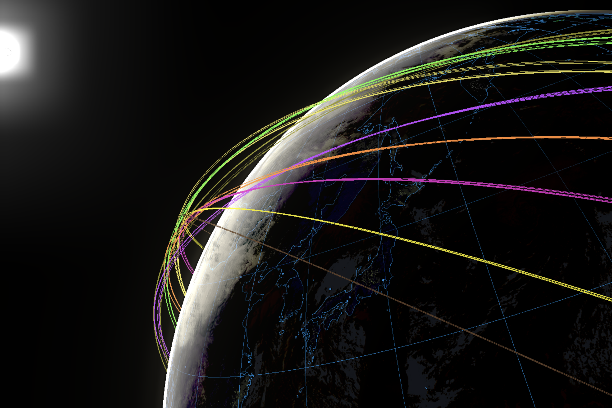
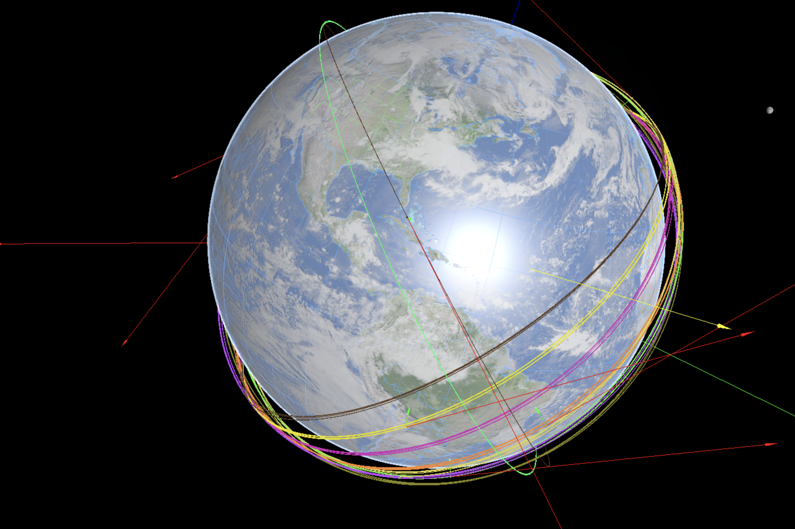

# REENTER v2 - Space Simulation Visualizer in Three.js




This project utilizes WebGL via the Three.js library and the physics engine Cannon.js to create a realistic space simulation environment. This setup includes interactive controls and dynamic visualizations of celestial objects like the Earth-Moon system and the Sun. The simulation is designed to display complex orbital mechanics in a user-friendly 3D interface.

There are no good space simulation environments with high quality visualization that run with modern software. Reenter means to change that by building an opensource simulation tool that can grow with its own community. Try it out and improve on it.

All visuals implemented from scratch. Physics running in cannon-es latest version through a service worker. Some mathematical models are running in javascript for now, would be great to change to higher precision ones later (C#?).

## Features

- Realistic 3D rendering of the Earth-Moon system and the Sun with orbit controls.
- Realtime physics simulation for spacecraft navigation.
- GUI for real-time interaction, satellite creation, and visualization adjustments.
- Dynamic data visualization of satellite metrics such as altitude, velocity, atmospheric drag, and acceleration.
- Customizable time warp features to speed up or slow down the simulation by many orders of magnitude.
- Runs on the browser in high performance (trying to make it even faster).
- Tested on iPhone at 60fps. (let me know how it performs on your machine 🙂).

## To-do

- Timeline based interface for complex missions.
- JSON interface for missions
- API
- Simulation data streaming
- Whole solar system

## Installation

Ensure you have [Node.js](https://nodejs.org/) installed on your machine. Then, follow these steps:

1. Clone the repository:

   ```bash
   git clone https://your-repository-url
   cd your-repository-directory
   ```

2. Install the required dependencies:

   ```bash
   npm install
   ```

3. Start the development server:

   ```bash
   npm start
   ```

This will run the application on `http://localhost:3000`.

## Usage

1. **Navigating the Scene**: Use the mouse for orbiting around objects, zooming in and out. Also works with touch screens(drag, pinch, etc). 
2. **Interacting with GUI**: Adjust simulation parameters like time warp, object visibility, and physics variables through the GUI.
3. **Viewing Data**: Real-time data for satellites can be viewed and analyzed via the integrated chart system (wip).
4. **Create and manage Spacecraft**: launch satellites from specific locations on Earth to any orbit. Currently only allows for only the first orbit implementation, working on multi-impulse capabilities.

## Contributing

Contributions to enhance or expand the simulation capabilities are welcome. Please follow the standard fork, branch, and pull request workflow.

## Licensing

This project is licensed under the MIT License - see the [LICENSE.md](LICENSE) file for details.

## Acknowledgments

- Three.js and Cannon.js communities for continuous support and resources.
- Contributors and maintainers of the `stats.js`, `cannon-es-debugger`, and other utilized libraries.

## Contact

For support or queries, contact [jm@reenter.space](mailto:jm@reenter.space).
